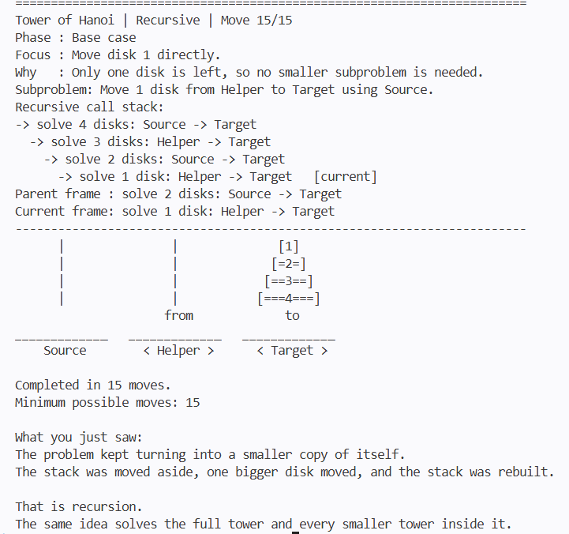
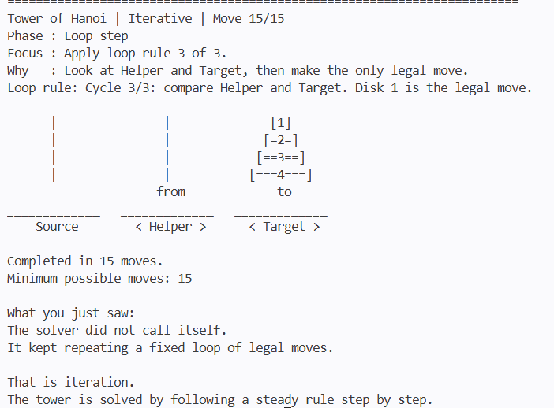

# Tower of Hanoi CLI Demo

This repository is a Python-based command-line demonstration of the **Tower of Hanoi** problem, created in response to the following challenge:

> Please create a "Tower Of Hanoi" or "Conway's Game of Life" code demonstration in a scripted language or bash script. This can be short, just enough to demonstrate functionality with simple graphics. Ideally, you can identify and comment on the sections that demonstrate recursion and / or iteration.

The project uses simple terminal graphics to animate the puzzle and includes **both recursive and iterative solutions** so the two approaches can be compared clearly.

## What This Demo Shows

- A **recursive Tower of Hanoi solver**
- An **iterative Tower of Hanoi solver**
- A **CLI animation layer** that displays the towers after each move
- A clean separation between:
  - problem-solving logic
  - terminal rendering / explanation

## Project Structure

```
src/
├── main.py              Entry point. Choose recursive or iterative mode and run the demo.
├── recursive_hanoi.py   Recursive solution logic. Highlights subproblem decomposition.
├── iterative_hanoi.py   Iterative solution logic. Loop-based legal-move solver.
├── cli_display.py       Terminal output, ASCII tower rendering, explanations.
└── hanoi_common.py      Shared data structures and helpers.
tests/                   Test directory.
```

## How Recursion And Iteration Are Demonstrated

### Recursion

The recursive implementation is in `recursive_hanoi.py`.

It demonstrates recursion by:
- solving the same problem on a smaller stack
- reaching a base case when only one disk remains
- returning to the larger problem after the smaller one is solved

The recursive section is commented in code, and the CLI display also shows the current recursive call stack / subproblem to make the flow easier to follow.

### Iteration

The iterative implementation is in `iterative_hanoi.py`.

It demonstrates iteration by:
- using a loop to repeatedly choose the next legal move
- following a fixed rule pattern instead of function self-calls
- solving the puzzle step by step until all moves are complete

The CLI display explains the loop rule being applied at each step.

## Screenshots




## Simple Graphics

The graphics are intentionally terminal-only and lightweight:

- towers are drawn with ASCII characters
- disks are labeled by size
- each move is shown visually
- `from` and `to` markers indicate disk movement

This keeps the demo easy to run while still making the algorithm visually understandable.

## How To Run

Using Make (shortcuts):

```bash
make rec           # recursive (default 3 disks)
make rec disks=5   # recursive with 5 disks
make it            # iterative (default 3 disks)
make it disks=4    # iterative with 4 disks
make test          # run tests
make clean         # clean __pycache__
```

Or directly with Python:

```bash
python -m src.main recursive --explain
python -m src.main iterative --explain
```


## Why I Chose Tower Of Hanoi

Tower of Hanoi is a compact problem, but it is very effective for demonstrating:

- recursive thinking
- iterative control flow
- step-by-step algorithm visualization

Instead of only printing move numbers, this project turns the solution into a visual terminal walkthrough so that the logic can be followed more easily by someone seeing the puzzle for the first time.

## Challenge Alignment

This project matches the original problem statement because it:

- uses a **scripted language**: Python
- implements **Tower of Hanoi**
- includes **simple graphics** in the command line
- explicitly identifies **recursion** and **iteration**
- stays lightweight and easy to run
